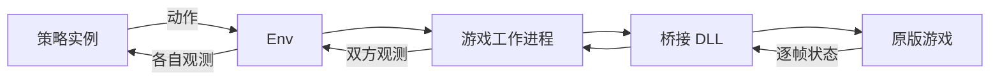

# 架构与职责

Python 训练代码分为 Env、RL、MARL 三层。Policy 定义可运行的策略；play 和 evaluation 调用策略及环境，不拥有另一套学习算法。

| 目录 | 职责 |
| --- | --- |
| `src/soku_rl/env/` | 游戏时间步、角色和卡组选择、观测、双方按键、历史、延迟、奖励、结束条件和后端通信。 |
| `src/soku_rl/rl/` | 唯一的 PPO 创建、恢复、保存和更新流程，以及单方训练视角、双人轨迹收集、网络输入编码和样本存储。 |
| `src/soku_rl/marl/` | IPPO 的双方学习组织、NFSP 的平均策略、PSRO 的种群与对手分布；强化学习更新均调用 RL 层。 |
| `src/soku_rl/policy/` | 策略定义、逐局实例、加载器、模型与规则实现。 |
| `src/soku_rl/evaluation/` | 对战收益采样、基准评测和结果统计。 |
| `src/soku_rl/play/` | 实时对局、逐局策略状态和比赛生命周期。 |
| `src/soku_rl/replay/` | 官方回放格式、游戏记录读取和环境轨迹归档。 |
| `tools/game_runtime/` | 游戏启动、原游戏回放播放，以及环境和回放共用的观测读取器。 |
| `tools/network_runtime/` | 网络游戏进程管理、双方启动顺序、共享内存状态与输入通信。 |
| `tools/` | Hydra 命令入口、Windows 游戏工作进程和原生通信。目前该目录仍需按运行与验证职责进一步整理。 |
| `native/SokuRLBridge/` | MSVC x86 DLL：在原游戏输入和战斗更新位置控制步进、读取状态。 |

配置只有 `config/` 一套 Hydra 空间。`config/rl/` 定义共享 PPO 设置，`config/algorithm/` 定义对手与种群组织，`config/track/` 选择拟人或超人环境。

## 策略接口

`Policy` 保存策略名称和文件或规则指纹。`spawn(seed)` 创建一局中一个座位独占的 `Actor`；`Actor.act(observation)` 返回动作。每个实例独占记忆和随机数状态。

- `RLPolicy` 表示由学习参数定义的策略，包括前馈 PPO、循环 PPO、NFSP 平均策略和部署模型。
- `RulePolicy` 表示显式规则，包括均匀随机、项目规则和原版神 AI 脚本。
- `MixturePolicy` 在一局开始时抽取一个成员，整局使用该成员。

`policy/loader.py` 是共同加载入口，评测和对战复用它。`policy/contract.py` 核对观测、动作、历史和延迟配置。旧 NFSP 与 BenchMARL 权重保留只读加载兼容；新训练不使用它们的强化学习实现。

`spawn_play(seed)` 还返回实例的小局重置约定。学习策略每个小局重置；原神 AI 在整场比赛内连续运行，不跳过击倒和局间帧。混合策略继承被选中成员的约定。`play/match_policies.py` 按这个约定维护独立历史、动作延迟和记忆，不复制另一套策略推理。

环境不导入具体策略。逻辑输入在 `env/encoding.py` 定义；诊断状态记录在 `env/observation/diagnostic.py` 定义。规则的动作词表转换属于 `policy/rules/observed_rules.py`。种群收益采样属于 `evaluation/population.py`。

## 游戏与策略之间的数据流

`Episode` 共用历史、延迟和结束规则；PettingZoo 单局接口与 `TwoPlayerVectorEnv` 批量接口调用同一实现。PPO、IPPO、NFSP、PSRO 都使用该批量环境。TorchRL 保留为外部环境适配器，不再承担 IPPO 训练。

一个动作由水平、垂直方向和六个按钮组成。双方在同一个模拟帧提交输入。只有游戏完成战斗更新才增加模拟帧号；窗口刷新和 Python 查询不增加帧号。

## 两类观测

拟人模式使用图像或经过可见性过滤的公开状态，并执行配置中的决策间隔与动作延迟。

超人模式使用 `privileged_state`，每帧决策、零环境延迟。原神 AI 和学习策略收到相同的双方角色、全部对象、碰撞框、手牌、技能和角色专用字段。每个 32 位字段用两个分量表示，以免浮点表示丢失低位。对象超出声明容量时立即报错，不能截断后继续训练。

共享 PPO 编码器按原顺序处理全部对象，并保留双方角色字段及己方动作历史。前馈 PPO 的轨迹缓冲区和 NFSP 样本池无损压缩观测，取样时恢复原数组；GAE、采样顺序和 PPO 损失仍使用上游实现。循环 PPO 仍使用上游循环缓冲区。

环境初始化使用 `episode.match.player_0` 和 `player_1`，每方分别指定 `character`、`palette`、`deck`。角色范围为 0 至 19，卡组编号为 0 至 3。

## 运行边界与当前缺口

游戏与 DLL 为 32 位，Python 可为 64 位；内存中的游戏地址始终按 32 位解释。桥接 ABI 当前为 9，工作进程管道协议为 3，版本不符必须报错。父子进程管道只连接本任务创建的可信工作进程。`runtime.game_directory` 统一指定工作进程使用的游戏目录，路径按工作进程的 Windows 或 Wine 文件系统解释。

读取超人观测要求游戏暂停在指定帧。重置通过原游戏场景生命周期执行，不提供任意状态恢复。图像环境重建被选中的游戏实例，状态环境可复用实例。关闭只处理本后端拥有的进程。

离线环境与实时网络对战的时钟不同。`play/live_policy.py` 已支持完整超人观测，并要求逐帧决策；它保留游戏战斗时钟，只转换当前策略实例的相对帧号。网络传输仍限定公开状态、每 3 帧决策和 5 帧输入延迟。新的本地入口 `tools/play_match.py` 已通过暂停读取、单侧步进和共同策略加载器接通完整超人对战流程，真实游戏验收尚未完成。使用方法见[本地逐帧对战](local-match.md)。

ABI 9 增加 `StepWithControlledInputs`。`BridgeClient.step_controlled({0: keys})` 只接管 1P，`{1: keys}` 只接管 2P，同时传入两个座位则接管双方。未接管的一侧继续走原游戏输入处理。这个命令只适用于本地逐帧对战，联网模式仍拒绝它。比赛生命周期位于 `play/match.py`，通过 `MatchState` 共用本地和网络比赛的原游戏比分；进程和共享内存留在运行层。命令编码、座位选择和原生编译检查已通过，玩家实体按键及完整对战流程仍待游戏验证。

离线工作进程已在每局结束、重置、关闭及可恢复的异常退出时保存官方 `.rep`。回放导入共用环境观测读取器；环境记录按同名 JSON 中的校验信息、帧数和结束原因确定回合边界，外部回放可显式选择按输入流结束。轨迹保留原回放，重新导出时逐字节不变。转换不拼接多个环境回合，并保留完整原文件。输入计数与策略提议的区别、内存地址的变化及验证范围见[回放说明](replays.md)。

完整脚本的来源、缺失定义修补及逐帧证据见[神 AI 行为核对](community-ai.md)。算法与继续训练见[训练算法](algorithms.md)。
