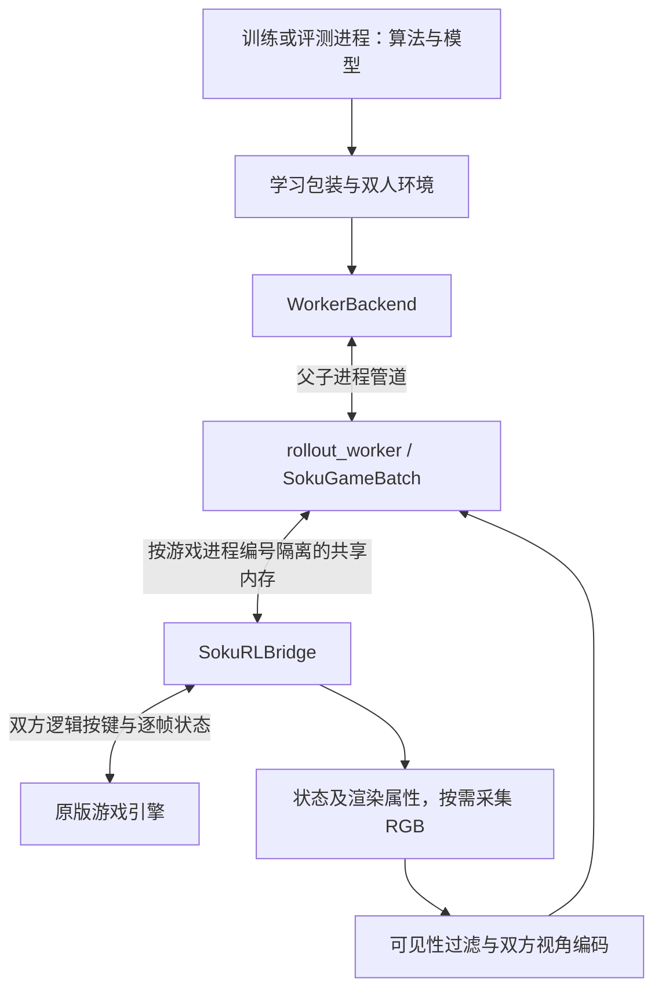

# 架构栈与数据流

SokuRL 把真实游戏封装为双人强化学习环境。战斗规则来自原版引擎；学习算法通过统一观测和按键接口与引擎交互。本文描述合并后的 ABI 8 源码，实验结论另见[验收记录](env-validation.md)。

## 技术栈及分工

| 层 | 技术 | 职责 |
| --- | --- | --- |
| 游戏 | th123 1.10a，Win32/x86 | 角色动作、碰撞、弹幕、伤害、天气、卡牌和随机演化 |
| 模块加载与桥接 | SWRSToys、SokuLib、C++、MSVC x86、CMake | 加载 DLL，在游戏输入和战斗更新边界接入控制 |
| 进程通信 | Windows 共享内存、Python 3.11 x64、ctypes | 按游戏进程编号交换命令、确认和逐帧状态 |
| 工作进程 | Python 管道；Linux 下使用 Wine | 隔离游戏依赖，管理本工作进程拥有的实例 |
| 环境 | NumPy、Gymnasium 空间、PettingZoo ParallelEnv | 定义双人接口、历史、动作延迟、奖励和结束条件 |
| 学习包装 | 项目内的观测和动作转换 | 附加公开特征、己方按键历史、可选动作子集和奖励塑形 |
| 学习算法 | PyTorch、Stable-Baselines3、sb3-contrib、TorchRL、BenchMARL、OpenSpiel | 网络推理、样本收集、优化及策略种群管理 |
| 配置和证据 | Hydra YAML、JSON、模型与回放文件 | 保存配置、版本、种子、模型身份和对局结果 |

Python 依赖及选装分组见 [pyproject.toml](../pyproject.toml)。原生源码、补丁和构建文件的身份见[依赖锁定记录](../config/dependencies.lock.json)。安装 Python 包不会安装游戏或 DLL。

## 进程之间如何连接

Linux 训练进程运行 PyTorch 和 CUDA；Wine 中的 Python 工作进程运行 Windows 游戏接口，不导入 CUDA 或 NumPy。Windows 也通过显式的 `runtime.command` 启动工作进程。模型库不进入游戏进程。

每个游戏的状态映射名为 `Local\SokuRLBridge_<pid>`。`pid` 是该游戏的进程编号。图像及渲染属性使用单独的共享内存，读取时核对模拟帧编号。管道只连接本程序创建的可信子进程，不是联网对战或远程服务协议。

## 代码职责

以下 Python 路径均相对 `src/soku_rl/`；带 `tools/` 或 `native/` 的路径相对仓库根目录。

| 文件或模块 | 管理的内容 |
| --- | --- |
| `pomg.py` | 双方观测、联合动作、时间步、策略和后端协议 |
| `tools/sokurl.py`、`tools/game_batch.py` | 游戏启动、连接、批量步进、重置和关闭 |
| `native/SokuRLBridge/ControlBlock.hpp`、`tools/bridge_shared.py` | C++ 与 Python 两端的协议布局及命令 |
| `tools/frame_stream.py` | 检查初始帧，按顺序复制帧队列，再确认已读取的记录 |
| `visibility.py`、`contours.py`、`visible_state.py` | 可见性判断、量化和公开状态编码 |
| `observations.py`、`env/encoding.py` | 诊断观测及离散按键编码 |
| `worker_pipe.py`、`tools/rollout_worker.py` | 父子进程请求与响应 |
| `env/control.py` | 双方同时提交、延迟队列和当前保持的按键 |
| `env/hisouten_env.py` | 共用的 Episode 逻辑与单局 PettingZoo 接口 |
| `env/vector_env.py`、`env/factory.py` | 多局组织及单局构造 |
| `learning_wrappers.py`、`learning_features.py` | 单局、多局共用的学习转换 |
| `ppo_training.py`、`ppo_response.py` | 固定对手 PPO 与 PSRO 的 PPO 响应训练 |
| `torchrl_env.py`、`benchmarl_task.py`、`benchmarl_training.py` | TorchRL 数据格式和 BenchMARL IPPO 任务 |
| `spiel_nfsp.py`、`nfsp.py`、`nfsp_response.py` | NFSP 双网络、逐局模式、批量转移与最佳响应更新 |
| `psro.py`、`population.py` | 策略种群、真实对局收益和混合策略 |
| `policy_benchmark.py`、`training_artifacts.py`、`checkpoint_policy.py` | 策略对战、训练产物定位和模型配置检查 |

## 一次决策如何执行

1. 算法收到双方各自的观测，同时给出两个动作编号。
2. 学习包装层把动作编号转换为基础按键编号；环境检查双方动作齐全。
3. `DelayedControls` 将联合按键放入延迟队列。在每个模拟帧开始前，取出已经到期的按键；其余时间保持原按键。
4. 后端将双方输入作为同一命令交给桥接模块。游戏完成一次战斗更新后，桥接模块增加帧号并发布结果。
5. Python 检查命令确认、目标帧号、暂停状态和丢帧计数，再生成双方观测。`Episode` 每帧更新历史及结束条件。
6. 达到决策间隔或提前结束时，环境返回观测、奖励、终止、截断及公开信息；学习包装层再附加特征与塑形奖励。

模拟帧只在游戏完成一次战斗更新后增加。窗口刷新、Python 查询和策略决策都不能计成游戏模拟帧。

## 两种多局组织

| 路径 | 组织方式 | 复用的规则 |
| --- | --- | --- |
| PPO、NFSP、PSRO | `TwoPlayerVectorEnv` 通过一个工作进程管理多个游戏；支持指定对局子集的步进与重置 | Episode、DelayedControls、LearningEpisode |
| BenchMARL IPPO | TorchRL `ParallelEnv` 组合单局工厂；每个单局拥有自己的工作进程 | 同一套单局与学习包装规则 |

环境编号和玩家编号是两个不同维度，不能直接展平为互不相关的单智能体任务。一个工作进程处理重置时，调用方须等该请求完成后才能继续提交请求。并发数和吞吐量需按实际运行路径测量。

## 协议、重置与资源所有权

ABI 指 C++ 与 Python 共同遵守的二进制布局及命令约定。当前版本为 8，双方布局必须一致；旧版本 DLL 会被拒绝。Python 为 64 位，游戏内地址仍按 32 位解释。

状态观测的 `ResetEpisode` 经过游戏场景生命周期重建对局，保留已有游戏进程。图像观测重建被选中实例的游戏进程，因为原生场景重载在两帧特效上留下可复现的像素差异；未选中的实例保持原进程和进度。这项处理增加图像模式的重置耗时，不增加状态模式的渲染。工作进程通过 `reset_methods` 报告各观测模式的重置方式。

两种方式都会重置环境历史、延迟队列和按键。`GotoFrame` 仍返回不支持恢复的结果；外部输入重放和局内重置都不提供任意状态克隆。

512 帧环形缓冲区采用单生产者、单消费者方式；不能让两个读取程序消费同一实例。帧不匹配、丢帧、超时或场景错误必须作为运行错误处理，不能当作策略输掉一局。

关闭只针对本后端创建的游戏。不同 Wine 环境若共用游戏目录，不能依靠 Windows 命名互斥量保护启动配置；独立运行需隔离可写游戏配置。已有故障和处理记录见[环境验收](env-validation.md)。

## 仍需整理的边界

`game_batch.py` 与验收脚本通过 `frame_stream.py` 共用初始帧等待和帧队列读取。环形队列及 32 位序号回绕在这个模块处理；目标缓冲区不足时，在复制或确认记录之前报错。批量环境与规则联赛直接使用桥接层的同步等待接口。

场景执行仍依赖 `frame_validation.py` 中的练习场实例管理。后续需将这项职责迁入运行模块，并验证原有入口的行为。观测模型见[环境建模](environment-model.md)，算法分工见[训练算法](algorithms.md)。
