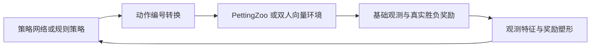

# 帮助策略学习的环境包装层

## 目标与位置

基础环境负责真实游戏规则、信息可见性、输入延迟、逐帧推进和重置。包装层负责让学习算法更容易使用这些输入。它不能读取新的内存字段，不能缩短延迟，也不能替策略执行额外游戏帧。



`learning_wrappers.py` 的 `LearningEpisode` 保存每局历史和奖励势函数。`LearningParallelEnv` 与 `LearningVectorEnv` 复用它。`learning_features.py` 只从公开观测计算数值特征；它没有进程句柄或内存读取接口。

配置统一位于 `config/wrappers/`。运行记录保存解析后的配置。加载模型时同时检查基础环境和包装层配置；维度碰巧相同不代表模型可以混用。

## 观测

拟人学习配置保留原来的 1600 维状态历史，追加 37 维派生特征和 64 维己方按键历史，共 **1701 维**。

| 追加内容 | 维数 | 信息来源 |
| --- | ---: | --- |
| 双方共同可见标记、相对位置及距离 | 4 | 当前过滤后的角色位置 |
| 双方可见标记和位置变化 | 6 | 最近状态历史中的首尾位置 |
| 离己方最近的己方与敌方物体，各 4 个 | 24 | 可见物体位置；每个含标记和两个相对坐标 |
| 血量差、灵力差、已用帧数占比 | 3 | 可见界面数值和己方时钟 |
| 己方最近 8 次提交的按键 | 64 | 策略自己提交的 8 个逻辑输入值 |

角色不可见时，相对位置及移动特征填零，并提供无效标记。物体槽不包含被过滤掉的物体。位置变化是屏幕上两次采样之差，仍含相机移动和量化误差，不是引擎中的精确速度。

己方按键历史不包含对手输入。默认每 3 帧决策，8 次按键记录覆盖 24 个模拟帧，包含默认 5 帧输入延迟内的待执行动作。重置清空它，并填入无按键状态。

超人学习配置保留 1356 维诊断观测，追加 64 维己方按键历史，共 **1420 维**。它不使用屏幕相对特征。

图像环境使用 `wrappers=image_learning` 时，每方收到字典观测：

| 字段 | 形状及类型 | 含义 |
| --- | --- | --- |
| `image` | `(13,240,320)`，uint8 | 原有 4 帧 RGB 和玩家身份通道 |
| `commands` | `(64,)`，float32 | 己方最近 8 次提交的逻辑按键 |

图像与按键分别输入网络，按键不会扩展为占用整张图的常数通道。重置只清空对应实例的按键历史。图像包装层使用基础胜负奖励；当前没有像素血量识别器，启用血量势函数会在启动游戏前报错。`wrappers=raw` 继续提供原有图像数组。

## 动作

| 配置 | 动作数 | 定义 |
| --- | ---: | --- |
| `full` | 576 | 9 种方向组合乘以 64 种按钮组合 |
| `combat` | 90 | 9 种方向组合乘以下列 10 种按钮组合 |

10 种按钮组合为：无按钮、A、B、C、D、换卡、符卡、A+D、B+D、C+D。A/B/C 为攻击键，D 为冲刺键。精简配置删除了其余同时按键组合，因此不能声称与完整动作空间等价；它是减少探索负担的实验配置。完整空间一直可选。

最终选择必须比较 `wrappers.action_set=combat` 与 `wrappers.action_set=full` 的实战结果。90 动作配置只是学习起点，动作较少本身不能证明最终策略更强。

包装层只转换当前提交的按键编号，不执行自动连招。一次选择仍保持到下一次决策，仍经过基础环境的延迟队列。规则策略也经过同一个映射；规则请求了未提供的组合时直接报错。

## 奖励

基础奖励保持为胜利 1、失败 -1、同时击倒和超时 0。超时仍由 `truncated=True` 和 `outcome=time_limit` 区分，不按剩余血量判胜。

学习配置采用势函数奖励塑形。设公开观测中双方归一化血量为 \(h_i\) 与 \(h_j\)，系数为 \(\alpha\)：

\[
\Phi_i(o_t)=\alpha(h_i(o_t)-h_j(o_t)),\qquad
r'_{i,t}=r_{i,t}+\Phi_i(o_{t+1})-\Phi_i(o_t).
\]

击倒和超时都将终局势函数设为零。当前算法配置的折扣为 \(\gamma=1\)，因此：

\[
\sum_{t=0}^{T-1}r'_{i,t}
=\sum_{t=0}^{T-1}r_{i,t}-\Phi_i(o_0).
\]

双方从满血开始时，初始势函数为零，整局累计奖励与原来的胜负奖励完全一致。造成伤害可以提前产生正反馈，但局末必须结清；只在超时时保留血量优势不能获得额外总收益。训练入口拒绝将该包装层与非 1 的折扣组合。

双方的血量势函数互为相反数，奖励仍为零和。`info` 同时记录 `base_reward` 与 `shaping_reward`。评估只看真实胜负、超时和交换座位后的统计，不用中途塑形奖励判定谁更强。

接近对手、出招次数或存活时间的额外奖励会改变整局目标，因此当前配置只采用能在局末结清的血量势函数。上述回报等式保留了目标，但不保证有限样本下的优化结果相同。

训练适配层把限时结束解释为本次有限时长博弈的终点：SB3 禁用时间上限的价值补偿，TorchRL 将训练用 `terminated` 设为真，NFSP 将后续折扣设为零。三者都停止估计局末之后的收益。基础 PettingZoo 环境仍返回 `truncated=True`；适配层保留 `source_truncated`，评测仍将超时单列。

方法依据：[Ng、Harada、Russell 的奖励塑形论文](https://ai.stanford.edu/~ang/papers/shaping-icml99.pdf)。上面的整局求和关系也直接给出了本项目有限时长设定下的约束。

## 记忆和训练

短历史不能覆盖长时间遮挡，因此增加公开的 [SB3 RecurrentPPO](https://sb3-contrib.readthedocs.io/en/master/modules/ppo_recurrent.html) 路径。它用 LSTM 保存历史信息；每个对局、每个座位各自拥有记忆，重置时清空。推理时也采用这个规则。

```text
python tools/train.py --config-dir config/local +machine=gpu41 algorithm=ppo wrappers=learning
python tools/train.py --config-dir config/local +machine=gpu41 algorithm=recurrent_ppo wrappers=learning
python tools/train.py --config-dir config/local +machine=gpu41 algorithm=nfsp wrappers=learning
python tools/train.py --config-dir config/local +machine=gpu41 algorithm=ippo wrappers=learning
python tools/train.py --config-dir config/local +machine=gpu41 algorithm=psro wrappers=learning
python tools/train.py --config-dir config/local +machine=gpu41 algorithm=recurrent_ppo track=superhuman wrappers=superhuman_learning
python tools/train.py --config-dir config/local +machine=gpu41 algorithm=ippo episode.observation_mode=image wrappers=image_learning
python tools/train.py --config-dir config/local +machine=gpu41 algorithm=psro episode.observation_mode=image wrappers=image_learning
```

PPO 从每局固定的规则对手分布中抽样，分别训练两个座位。IPPO、NFSP 和 PSRO 仍使用双人学习接口。算法的动作维度从包装后环境读取，不再写死为 576。

TorchRL 为 BenchMARL 将图像转成 HWC 浮点数组，按键仍是独立数值向量；BenchMARL 卷积模型同时接收两类输入。PSRO 的 SB3 响应策略使用 `MultiInputPolicy` 处理字典观测。当前固定规则对手不能读取像素，因此固定规则 PPO 训练入口只接受状态观测；NFSP 当前也只接受数值向量。这些限制会在启动游戏之前检查。

PPO 每局训练记录包含对手名称、对手实现指纹、双方座位、世界种子、对手随机种子、基础累计回报和塑形后的累计回报。这些信息保存在训练记录中，不进入策略的观测。基础环境也不读取对手策略的名称。

### 从已有 PPO 模型继续训练

`algorithm.initial_policies` 分别指定两个座位的起点，默认均为 `{kind: fresh}`。继续训练时，对相应座位填写 `kind: checkpoint`、`path` 和 `training_config`。程序检查基础观测、包装层、延迟和算法参数是否一致，恢复网络及优化器，并记录源文件哈希。`timesteps_per_player` 表示本次增加的决策数；结果分别记录起始、增加和累计决策数。

继续训练会开始新的独立对局，可以调整并行实例数及训练对手分布。它不恢复中断时的游戏状态、循环记忆、未完成的采样批次或随机数流，因此不是对旧运行逐位一致的续跑。输入配置不兼容时直接报错。对局重置仍保留原生进程；训练恢复不充当游戏崩溃后的自动重启。

调参时可以显式指定 `kind: weights`，同时填写模型 `path` 和对应的 `training_config`。此模式只复制策略与价值网络权重，优化器和决策计数重新初始化；允许调整学习率、`gae_lambda`、批次长度等训练参数。观测、动作、延迟、网络结构、策略类型和终局收益约定必须一致，否则拒绝启动。运行结果记录源模型哈希和源模型决策计数。它与保留优化器的 `kind: checkpoint` 是两种不同的实验条件，比较结果时必须说明。

### NFSP 的价值目标

原始 NFSP 运行出现了十万量级的价值损失。这是稳定性问题，不能把有限数值的参数更新当作有效学习证据。新配置 `algorithm.response_update=bounded_double_q` 保留 OpenSpiel 的网络、经验回放、平均策略学习和优化器，修改最佳响应的目标计算：当前网络选择下一步动作，目标网络评估该动作，然后将训练目标限制在本环境剩余收益的已知范围内。`algorithm.response_update=openspiel` 保留原实现作对照。

当前有限对局只在终局给出胜负收益，且血量势函数的系数为 \(\alpha\)。在折扣为 1、终局势函数归零的设定下，从任意非终局时刻开始的剩余累计奖励为终局收益减去当前势函数，因此：

\[
G'_t=z-\Phi_i(o_t),\quad z\in\{-1,0,1\},\quad |\Phi_i(o_t)|\leq\alpha,
\qquad G'_t\in[-1-\alpha,1+\alpha].
\]

程序用 \(1+\alpha\) 作为目标绝对值上限，同时记录预测范围、目标范围和触及裁剪的样本比例。它不会裁剪游戏观测或改写奖励。非有限数值仍会报错。这是待比较的算法配置，不代表已经提高实战胜率。

动作选择与估值分离的方法来自 [Double DQN 论文](https://arxiv.org/abs/1509.06461)。收益范围来自本项目的终局奖励及势函数定义。

## 验收与后续实验

现有检查覆盖：两种环境接口使用相同转换；动作映射可逆；输入延迟不变；部分重置不影响其他实例；击倒和超时的整局奖励结算；TorchRL 张量空间；NFSP 的 90 动作更新；模型加载输出一致性；循环策略的跨局记忆隔离。

这些检查不证明包装层提高胜率。训练需保留原始配置对照，并在同一规则对手列表和交换座位的完整比赛中评估。模型选择使用 `evaluation=validation`；模型和包装配置固定后，最终验收使用 `evaluation=test`。两组各有 32 个世界种子，互不重叠，策略随机种子也不同。最终测试结果不能用于继续选择包装配置，否则它就成为验证数据，需要另建测试集。

当前[规则策略池](rule-policy-pool.md)包含 15 个非空闲对手，按现有的“至少击败一半对手”规则，每条赛道需击败至少 8 个。击败某个对手指真实胜局比例超过一半，超时不计胜。每组完整评测包含 32 个种子、15 个对手及交换座位，共 960 局。旧的五对手结果不能直接与扩充后的结果比较。

比较按以下顺序推进，每次保持对手列表、训练预算和验证种子一致：

1. 普通 PPO 的原始观测与学习观测对照。
2. 循环 PPO 的原始观测与学习观测对照，区分记忆网络和包装层的收益。
3. 对胜率更高的配置分别关闭血量塑形、相对特征和按键历史，判断哪些输入值得保留。
4. 比较 90 与 576 动作；再把选出的配置用于自博弈和策略种群训练。

动作回放记录实际提交的命令，可用 `tools/render_replay.py` 通过真实游戏重新播放。评测若发生环境错误，会保存尚未结束的动作序列到 `failed-*.npz`，并在 `failure.json` 记录错误与对应种子；这些对局不能计作胜、负或超时。

仍需补齐：结构化观测中的可见动作姿态和卡牌界面信息，以及上述强度比较。当前位置与血量特征不足以表达画面里全部可见的战斗信息，不能据此宣称已经得到最强策略。
