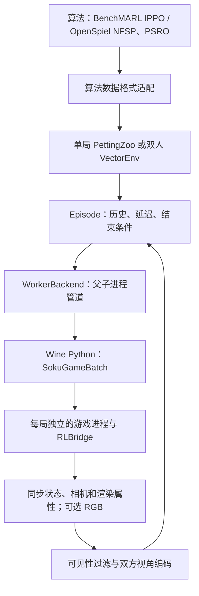

# 双人环境、多环境采样与公开算法

## 当前接口

公共接口是 PettingZoo `ParallelEnv`。双方为 `player_0` 和 `player_1`，同时提交动作，同时得到新观测。环境不内置对手策略。Gymnasium 只负责定义动作和观测空间。

单局在首次击倒、同时击倒或达到配置的帧数上限时结束。这是三局两胜比赛中的小局。环境对象、Wine 工作进程和游戏进程持续使用。ABI 8 的 `reset` 让引擎通过场景生命周期重建对战，保留游戏进程编号；它不是任意内存快照恢复。重置等待旧对战场景完成析构，再初始化新对局。旧 ABI 7 的诊断模块通过了 32 轮完整回放对照；ABI 8 的验收另行记录，不能沿用旧模块的验证结论。

ABI 8 合并了主仓库的有符号灵力字段和本分支的进程内重置命令。当前 ABI 9 在此基础上增加按座位接管输入的逐帧命令；Python 控制接口只接受 ABI 9，拒绝混用旧 DLL。ABI 8 的实测结果保留为历史证据，不能替代 ABI 9 的游戏验证。原始灵力允许出现 `-88` 等过渡值；公开观测和诊断观测中的灵力比例将负值裁剪为零。

## 分层和进程



| 模块 | 职责 |
| --- | --- |
| `native/SokuRLBridge` | 执行原生按键、同步模拟帧、采集对应状态和可选图像 |
| `tools/game_runtime/batch.py` | 启动、重置、步进和关闭本工作进程拥有的游戏 |
| `visibility.py`、`contours.py` | 屏幕投影、量化、透明度和粗略遮挡 |
| `visible_state.py` | 把过滤后的信息编码为双方各自的向量 |
| `env/control.py` | 决策间隔和延迟按键队列 |
| `env/hisouten_env.py` | 单局历史、奖励、终止及 PettingZoo 接口 |
| `env/vector_env.py` | 复用单局逻辑，推进和重置环境子集 |
| `learning_wrappers.py`、`learning_features.py` | 奖励塑形、公开派生特征、己方按键历史和动作编号映射 |
| `torchrl_env.py`、`benchmarl_task.py` | 转换张量布局，声明 BenchMARL 任务 |
| `spiel_nfsp.py`、`nfsp.py` | OpenSpiel NFSP 的批量决策、显式转移和训练调度 |
| `psro.py`、`population.py`、`ppo_response.py` | 策略种群、真实对局收益、PPO 响应训练 |
| `ppo_training.py`、`recurrent_policy.py` | 固定规则对手训练和每局独立的循环策略记忆 |

Linux 进程负责 PyTorch 与 CUDA。Wine Python 使用纯 Python 字节读取图像，不导入 NumPy 或 CUDA。模型库不进入游戏进程。

有两种并行组织方式。自有 `TwoPlayerVectorEnv` 用一个 Wine 工作进程管理多个游戏，联合提交按键后等待所有指定实例完成；BenchMARL 用 TorchRL `ParallelEnv` 组合多个单局工厂，每个单局拥有自己的工作进程。两者复用同一 `Episode` 规则，不能把吞吐量视为相同。

管道使用 Python 序列化，只连接本程序创建的可信子进程。它不是远程服务协议。工作进程标准输出只传协议消息，诊断写入独立日志。

## 构造单局

运行配置统一使用 Hydra，`config/train.yaml` 组合算法与赛道配置。机器上的 Wine 命令保存在忽略提交的本地配置中。

以下代码中的 `cfg` 是已经解析的配置字典：

```python
from soku_rl.env.factory import make_pettingzoo_env

env = make_pettingzoo_env(cfg["runtime"], cfg["episode"], "logs/workers")
try:
    observations, infos = env.reset(seed=123)
    while env.agents:
        actions = {name: env.action_space(name).sample() for name in env.agents}
        observations, rewards, terminated, truncated, infos = env.step(actions)
finally:
    env.close()
```

双方必须在同一个 `step` 中提交动作。结束的最后一步保留双方终局观测，之后 `agents` 为空，必须 `reset` 才能开始下一局。种子取值为 0 至 4294967294；原生模块保留了 4294967295。

`reset(seed=None, options=None)` 的默认参数遵循 PettingZoo。未指定种子时由环境随机数发生器生成。`options` 必须是字典或 `None`；目前不从该字典修改运行配置。

## 多环境

`TwoPlayerVectorEnv` 的外层字典键是环境编号，内层键是玩家编号。用配置先调用工作进程的 `configure_observation`，再构造向量环境。

```python
from soku_rl.env import EpisodeConfig, TwoPlayerVectorEnv

episode = EpisodeConfig(**cfg["episode"])
backend.configure_observation(episode.backend_observation())
env = TwoPlayerVectorEnv(backend, cfg["num_envs"], episode)
observations, infos = env.reset({i: 1000 + i for i in range(env.num_envs)})
actions = {i: {a: actors[i][a].act(value) for a, value in players.items()}
           for i, players in observations.items()}
observations, rewards, terminated, truncated, infos = env.step(actions)
```

`reset({3: 2003, 9: 2009})` 只重置环境 3 和 9 的游戏、历史和待执行按键。`step` 也接受环境子集；其余环境保持暂停。同一工作进程的重置是同步调用，其他实例要等待它完成后才能继续获得动作。

这不是 Gymnasium 的单智能体 VectorEnv。不能将环境维和玩家维直接展平后当作互不相关的单智能体任务。

## 观测、动作和结果

| 模式 | 每方观测，历史长度为 4 时 | 用途 |
| --- | --- | --- |
| `state` | `(1600,)`、float32 | 默认拟人赛道；每帧 400 个过滤后字段 |
| `image` | `(13,240,320)`、uint8 | 4 帧 RGB，加一个玩家身份通道 |
| `diagnostic_state` | `(1356,)`、float32 | 超人赛道；包含内部动作编号和瞬时速度 |

状态观测每帧包括双方各 8 个角色字段，以及双方各 64 个物体槽、每槽 3 个字段。角色字段是可见标记、量化屏幕位置、朝向、界面标记、量化血量和灵力、公开角色编号。物体槽为可见标记和量化屏幕位置。隐藏物体不保留列表位置；剩余槽填零。详情及近似误差见[可见性规范](human-aligned-env.md)。

历史包含最近的模拟帧，不是最近的决策帧。重置用本局初始观测填满历史。结构化状态仍是部分观测，不能作为完整引擎状态；PettingZoo `state()` 不提供伪造的集中式全局状态。

双方动作空间均为 `Discrete(576)`，表示两个三值方向轴和六个二值按钮。无按键为 **256**。环境不提供自动连招。拟人赛道每 3 个模拟帧接收一次决策，输入延迟 5 帧；超人赛道每帧决策、无额外延迟。配置可调整。

击倒时胜方奖励 1、负方 -1，同时击倒为 0。中间奖励为 0。达到上限返回 `truncated=True` 和 `outcome=time_limit`，不能报告为真实平局或按血量判胜。

公开 `info` 只含模拟帧、对局编号、结果、决策间隔和延迟。游戏种子、内存哈希和原始状态诊断进入运行记录，不进入策略输入。

## 算法适配

学习包装层位于基础环境与算法之间，PPO、IPPO、NFSP 和 PSRO 使用同一套转换。配置、维度、奖励约束与训练命令见[学习包装层](learning-wrappers.md)。本页下面的 576 动作和基础观测维度描述未包装的环境。

- **BenchMARL IPPO**：两个玩家组分别学习。TorchRL 使用官方 PettingZoo 包装器；图像从 CHW 字节转为 HWC 浮点数，供 BenchMARL 卷积模型使用。
- **OpenSpiel NFSP 2.0.2**：复用上游网络、DQN 回放和损失、蓄水池抽样及平均策略损失。每局每方固定一次最佳响应或平均策略模式。状态转移显式按环境提交，所有模式下都推进 DQN 更新计数。当前 NFSP 网络只接收数值向量，图像输入会明确报错。
- **OpenSpiel PSRO 2.0.2**：复用种群和混合策略求解，用真实对局采样替代游戏树遍历。Stable-Baselines3 PPO 训练响应策略。每局固定抽取的对手；旧种群策略不可被新训练覆盖。此接口不提供任意状态克隆或精确最佳响应。

NFSP、PSRO、固定对手 PPO 和 IPPO 都把时间上限视为有限时长博弈的零后续收益。算法适配层停止在超时处估计未来收益，保留来源标记；基础 PettingZoo 的超时接口不变。保存的 NFSP 文件包含推理权重、优化器和统计，但不含完整样本池和所有随机数状态，不能声称可以精确续训。

PSRO 的 `population.json` 保存两个座位各自的成员列表、模型相对路径、文件指纹和混合权重。公共加载器支持以下策略配置，其中 `training_config` 必须指向该次训练保存的配置：

```yaml
kind: psro_mixture
path: logs/training/psro-run/population.json
training_config: logs/training/psro-run/config.yaml
player: player_0
```

每局开始时按权重抽取一个成员，该成员负责整局动作。两个玩家分别使用自己座位的种群；模型文件指纹或观测配置不匹配时拒绝加载。交付时应一起保留 `population.json`、`config.yaml` 和所有响应模型。这个文件包支持评测与推理，不包含精确恢复 PSRO 训练所需的全部随机状态。

## 运行入口和证据

```text
python tools/validate_env.py --config-dir config/local +machine=gpu41
python tools/train.py --config-dir config/local +machine=gpu41 algorithm=ippo
python tools/train.py --config-dir config/local +machine=gpu41 algorithm=nfsp
python tools/train.py --config-dir config/local +machine=gpu41 algorithm=psro
```

增加 `track=superhuman` 可使用超人赛道配置；拟人赛道可用 `episode.observation_mode=image` 切换图像。

### 从完成的训练目录发起评测

`tools/benchmark_training.py` 读取训练目录的 `result.json` 和 `config.yaml`，要求训练成功结束且两个座位的最终模型都存在。PPO 使用每座位的 `final.zip`，NFSP 使用最终平均策略，PSRO 使用最终种群混合策略，IPPO 使用最终决策数对应的检查点。中途检查点不能代替缺失的最终模型。

```text
python tools/benchmark_training.py --config-dir config/local +machine=gpu41 training_directory=logs/training/run-name evaluation=validation
```

评测自动采用保存的算法、观测、动作包装、赛道和延迟配置。运行设备、采样进程、并行实例数、评估种子和输出位置仍由本次评测的 Hydra 配置决定。记录中包含训练结果文件的 SHA-256。旧的 12 帧策略会按 12 帧评测，不能因当前默认延迟是 5 帧而改变其条件。

模型选择完成后，将 `evaluation` 改为 `test` 执行独立测试。两个划分均包含 15 个规则对手、32 个世界种子和交换座位，共 960 局。加载与推理成功只证明模型文件可用，胜率目标仍须由完整评测证明。需要指定中途检查点时，使用原有的 `tools/benchmark.py` 并显式填写双方模型，不得将其报告为最终策略。

已取得的真实对局和接口检查证据见[环境验收记录](env-validation.md)。正式训练和最终交付须满足[完整验收清单](training-acceptance.md)。未完成双赛道胜率目标、可玩策略交付、回放视频和联网人机对战之前，不能宣布整个任务完成。
